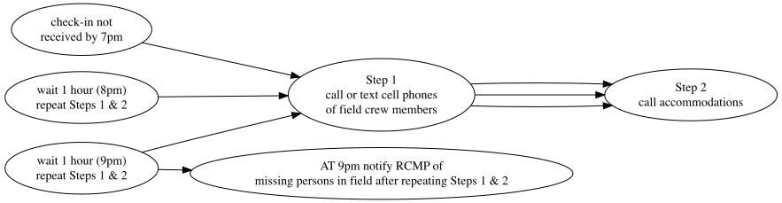

{.logo} 


 

<br>

::: from
Al Irvine  
New Graph Environment Ltd.  
al@newgraphenvironment   
250-777-1518  
Date Original: 2024-08-09  
Date Revised: `r format(Sys.Date(), "%Y-%m-%d")` 
:::


<br>

```{r setup, include = TRUE, echo =FALSE, message=FALSE, warning=FALSE}
# gitbook_on <- TRUE
gitbook_on <- FALSE  ##we just need turn  this on and off to switch between gitbook and pdf via paged.js


knitr::opts_chunk$set(echo=FALSE, message=FALSE, warning=FALSE, dpi=60, out.width = "100%")
options(scipen=999)
options(knitr.kable.NA = '--') #'--'
options(knitr.kable.NAN = '--')

source('scripts/packages.R')
source('scripts/staticimports.R')

## tried adding this as a global param but it only accepts static params.
name_project_complete <- paste0(params$name_project_number, '-', params$name_project_name)

link_kml <- paste0('https://github.com/NewGraphEnvironment/', params$name_repo, '/raw/main/mapping/sites_', params$name_project_name, '_', format(Sys.Date(), '%Y%m%d'), '_kml_gpx.zip')
link_pdf <- paste0('https://github.com/NewGraphEnvironment/', params$name_repo, '/raw/main/docs/', params$name_pdf, '_', params$name_project_name, '.pdf')
link_fieldmaps <- 'https://hillcrestgeo.ca/outgoing/fishpassage/projects/bulkley/'
link_fieldmaps2 <- 'https://hillcrestgeo.ca/outgoing/fishpassage/projects/kisp/'
link_fieldmaps3 <- 'https://hillcrestgeo.ca/outgoing/fishpassage/projects/zymo/'
link_fieldmaps4 <- 'https://hillcrestgeo.ca/outgoing/fishpassage/projects/morr/'

```

```{r accom-vehicles}

hotel1 <- "3876 Second Avenue 2, Smithers, BC V0J 2N0"
hotel2 <- "Sept 15 - 25: 4036 Second Avenue B, Smithers, BC V0J 2N0"
hotel3 <- "Sept 24 - Oct 5: 3876 Second Avenue #1, Smithers, BC V0J 2N0"

vehicle1 <- '2013 Toyota Tundra black w/flatdeck and yellow can-am quad'
vehicle2 <- '2006 Pontiac Vibe red'

```

```{r info-hospitals}
hospital_name <- 'Houston Health Centre'
hospital_phone <- '250-845-2294'
hospital_address <- '3202 14 St, Houston, BC V0J 1Z0'

hospital_name2 <- '(Smithers) Bulkley Valley District Hospital'
hospital_phone2 <- '250-847-2611'
hospital_address2 <- '3950 8 Ave, Smithers, BC V0J 2N0'

hospital_name3 <- 'Wrinch Memorial Hospital - Hazelton'
hospital_phone3 <- '250-842-5211'
hospital_address3 <- '2510 Hwy 62, Hazelton, BC V0J 1Y0'

```

```{r import-projects}
##Read in the contacts spreadsheet
####--------------bring in the equipment list and crew info-----------------
projects <-  readxl::excel_sheets(path = "../onboarding/data/equipment_contacts_safetylog.xlsx") %>% 
  purrr::set_names() %>% 
  purrr::map(readxl::read_excel,
             path = "../onboarding/data/equipment_contacts_safetylog.xlsx",
             .name_repair = janitor::make_clean_names) %>% 
  purrr::set_names(janitor::make_clean_names(names(.))) %>% 
  purrr::map(fpr::fpr_sheet_trim) |>  #this is the clean run of this function at_trim_xlsheet
  purrr::map(plyr::colwise(type.convert))

```

```{r settings-gitbook, eval= gitbook_on}
photo_width <- "100%"
font_set <- 11

```

```{r settings-paged-html, eval= identical(gitbook_on, FALSE)}
photo_width <- "80%"
font_set <- 8
```


<br>

# `r paste0('Safety Plan - ',name_project_complete)` {.unnumbered .break-after-me}

The latest version of this pdf can be downloaded [here](`r knitr::asis_output(link_pdf)`).


<br>

The main goal of this fieldwork is to evaluate fish passage and establish baseline data through electrofishing techniques, working closely with crews from the Office of the Wet’suwet’en. We will be completing fish passage (Phase 1) and habitat confirmation (Phase 2) assessments in the Bulkley, Morice, Kispiox, and Zymoetz River watershed groups. A summary of the potential sites for fish passage assessments, habitat confirmation assessments, and electrofishing is provided in Table \@ref(tab:tab-electrofishing-sites), with kml (Google Earth) and gpx (garmin) files downloadable [here](`r knitr::asis_output(link_kml)`). 

<br>

Georeferenced pdf maps can be accessed and downloaded for each watershed using the following links: [Bulkley](`r knitr::asis_output(link_fieldmaps)`), [Kispiox](`r knitr::asis_output(link_fieldmaps2)`), [Zymoetz](`r knitr::asis_output(link_fieldmaps3)`), and [Morice](`r knitr::asis_output(link_fieldmaps4)`). 

<br>

## New Graph Employee Information {.unnumbered}

Al Irvine  
*Vehicle:*  `r vehicle1`  
*Accommodation:* 
`r hotel2`  
`r hotel3` 


Lucy Schick     
*Vehicle:*  `r vehicle2`  
*Accommodation:* `r hotel1`


<br>

## Crew Members {.unnumbered}

New Graph Employees Al Irvine and Lucy Schick will be joined by crews from the Office of the Wet'suwet'en. All crew member information and emergency contacts can be found below.

<br>


```{r tab-crew, eval=TRUE}
crew_ids <- c('airvine', 
              'lschick', 
              'tpierre', 
              'vjoseph', 
              'jolson')


tab_crew <- projects |>  
  pluck('crew_contacts')  |>  
  filter(id %in% crew_ids) |>  
  select(-id) %>%  
  purrr::set_names(nm = names(.) |>  stringr::str_replace_all('crew_', ''))


tab_crew |>  
  fpr::fpr_kable(caption = 'Crew members details and emergency contacts', scroll = F) 

```

<br>

## Equipment Checklists {.unnumbered}

```{r table-equipment, eval=TRUE}

## personal equipment 

tab_eq_pers <-  readr::read_csv(
  url(("https://raw.githubusercontent.com/NewGraphEnvironment/new_graphiti/main/assets/data/equipment.csv")
  ))|> 
  filter(!is.na(eq_pers_standard)) |>  
  arrange(eq_safety) |>  ##have these first on the list
  select(eq_item)  |>  
  my_untidy_table() |>  
  rename(`Personal Equipment Checklist` = eq_item)

my_caption = 'Personal Equipment Checklist'

tab_eq_pers |>  
  fpr::fpr_kable(caption = my_caption, scroll = F)
```

<br>

```{r equip-crew, eval=TRUE}

##equipment for the crew
tab_eq_crew <-  readr::read_csv(
  url(("https://raw.githubusercontent.com/NewGraphEnvironment/new_graphiti/main/assets/data/equipment.csv")
  ))|>
  filter(if_any(starts_with('eq_task'), ~ . == 'fish passage')) |>  
  filter(is.na(eq_pers_standard)) |>  
  arrange(eq_safety) |>  
  select(eq_item)  |>  
  my_untidy_table() |>  
  rename(`Crew Equipment Checklist` = eq_item)

my_caption = 'Crew Equipment Checklist'

tab_eq_crew |>  
  fpr::fpr_kable(caption = my_caption, scroll = F)

```

<br><br>

## Nearest Hospitals {.unnumbered}

```{r hospital-1, fig.cap=my_caption, fig.width=6, eval=TRUE}
my_caption = paste(hospital_name, hospital_address, hospital_phone, sep = ' - ')

##register google key defined in 'R/private_info.R' file
ggmap::register_google(key = Sys.getenv('GOOG_API_KEY'))

#define the area of the base map by using a bounding box 
mybasemap <- ggmap::get_map(location = hospital_address,
                     source = "google",
                     zoom = 16,
                    maptype = "roadmap")  

# Extract the center coordinates from the map object
center_lon <- attr(mybasemap, "bb")$ll.lon + (attr(mybasemap, "bb")$ur.lon - attr(mybasemap, "bb")$ll.lon) / 2
center_lat <- attr(mybasemap, "bb")$ll.lat + (attr(mybasemap, "bb")$ur.lat - attr(mybasemap, "bb")$ll.lat) / 2
# Plot the map with the hospital symbol at the center
ggmap::ggmap(mybasemap) +
  geom_text(aes(x = center_lon, y = center_lat), 
            label = "H", 
            size = 10, 
            colour = "red", 
            fontface = "bold")

```

```{r hospital-2, fig.cap=my_caption, fig.width=6, eval=TRUE}
my_caption = paste(hospital_name2, hospital_address2, hospital_phone2, sep = ' - ')

#define the area of the base map by using a bounding box 
mybasemap <- ggmap::get_map(location = hospital_address2,
                     source = "google",
                     zoom = 16,
                    maptype = "roadmap")  

# Extract the center coordinates from the map object
center_lon <- attr(mybasemap, "bb")$ll.lon + (attr(mybasemap, "bb")$ur.lon - attr(mybasemap, "bb")$ll.lon) / 2
center_lat <- attr(mybasemap, "bb")$ll.lat + (attr(mybasemap, "bb")$ur.lat - attr(mybasemap, "bb")$ll.lat) / 2
# Plot the map with the hospital symbol at the center
ggmap::ggmap(mybasemap) +
  geom_text(aes(x = center_lon, y = center_lat), 
            label = "H", 
            size = 10, 
            colour = "red", 
            fontface = "bold")

```

```{r hospital-3, fig.cap=my_caption, fig.width=6, eval=TRUE}
my_caption = paste(hospital_name3, hospital_address3, hospital_phone3, sep = ' - ')

#define the area of the base map by using a bounding box 
mybasemap <- ggmap::get_map(location = hospital_address3,
                     source = "google",
                     zoom = 16,
                    maptype = "roadmap")  

# Extract the center coordinates from the map object
center_lon <- attr(mybasemap, "bb")$ll.lon + (attr(mybasemap, "bb")$ur.lon - attr(mybasemap, "bb")$ll.lon) / 2
center_lat <- attr(mybasemap, "bb")$ll.lat + (attr(mybasemap, "bb")$ur.lat - attr(mybasemap, "bb")$ll.lat) / 2
# Plot the map with the hospital symbol at the center
ggmap::ggmap(mybasemap) +
  geom_text(aes(x = center_lon, y = center_lat), 
            label = "H", 
            size = 10, 
            colour = "red", 
            fontface = "bold")

```


<br>

## Emergency Response Plan {.unnumbered}

New Graph's detailed emergency response procedures can be found [here](https://www.newgraphenvironment.com/hsp/plans-and-assessments.html#emergency-response-plan-erp-and-procedures). These procedures should be reviewed and an emergency response plan should be completed for each job site. Our Emergency Response Plan template can be downloaded [here](https://github.com/NewGraphEnvironment/hsp/blob/master/data/form_templates/ERP_template.pdf).

<br>

## Driving {.unnumbered}

We will be driving on forest service roads where it is essential to exercise caution and adhere strictly to all radio use protocols to ensure our safety. Proper communication on these roads helps prevent accidents by keeping everyone informed about vehicle movements and road conditions. Please review the [resource road safety](https://www.newgraphenvironment.com/hsp/safe-work-procedures-and-practices.html#resource-road-safety) and [radio use](https://www.newgraphenvironment.com/hsp/safe-work-procedures-and-practices.html#radio-use) sections of our Health and Safety plan so that everyone stays safe. 

<br>

## Field Plan {.unnumbered}

The primary objective of the fieldwork is to assess fish passage and establish baseline monitoring, using electrofishing techniques, in collaboration with crews from the Office of the Wet'suwet'en. We will be completing fish passage (Phase 1) and habitat confirmation (Phase 2) assessments in the Bulkley, Morice, Kispiox, and Zymoetz River watershed groups. Fieldwork methods will produce reports such as the [Skeena Watershed Fish Passage Restoration Planning 2023](https://www.newgraphenvironment.com/fish_passage_skeena_2023_reporting/). Additional reports can be found [here](https://www.newgraphenvironment.com/fish_passage_skeena_2023_reporting/executive-summary.html).


General fieldwork procedures can be found in our [Fish Passage Guidebook](https://www.newgraphenvironment.com/fish_passage_guidebook/). We generally follow procedures in:

-   [fish passage assessments](https://www2.gov.bc.ca/assets/gov/environment/natural-resource-stewardship/land-based-investment/forests-for-tomorrow/field-assessment-for-determining-fish-passage-status-of-cbs.pdf) [@fish_passage_assessments]

-   [habitat confirmations](https://www2.gov.bc.ca/assets/gov/environment/natural-resource-stewardship/land-based-investment/forests-for-tomorrow/checklist-for-fish-habitat-confirmation-201112.pdf) [@confirmation_checklist_2011].

<br>

Presence/absence of fish, species composition/density and distribution limits can be useful for prioritizing which crossings are a best fit for fish passage restoration and help inform follow up monitoring so electrofishing and minnowtrapping may be conducted. Standard Fish and Fish Habitat Inventory Standard Field Form [Site Cards](https://www2.gov.bc.ca/gov/content/environment/natural-resource-stewardship/laws-policies-standards-guidance/inventory-standards/aquatic-ecosystems) are used to gather habitat data, and the Field Guide to these Site Cards can be found [here](https://www2.gov.bc.ca/assets/gov/environment/natural-resource-stewardship/nr-laws-policy/risc/sitecard20.pdf).

<br>

We have PIT tagging equipment and could consider [tagging](https://www.youtube.com/watch?v=9CKZ9yaS5o8) fish captured at electrofishing sites to help us better understand population sizes and fish movement upstream and downstream of sites over the years.

<br>

We use digital field form using a product called [Mergin Maps](https://merginmaps.com/?gclid=Cj0KCQjwxb2XBhDBARIsAOjDZ34oq-iMid3vRrgK1ZAkJ_yiz4aWY-LLF90PHiXzELbZIrxooV9vWKYaAgl2EALw_wcB) which syncs with QGIS. Please see our [Fish Passage Guidebook](https://www.newgraphenvironment.com/fish_passage_guidebook/data-collection-and-field-navigation.html#mergin-maps) for instructions on how to set up Mergin Maps and use our digital field forms. Please send me your usernames and we can begin to share projects/forms.

<br>

A guide to freshwater fish id such as @mcphail_carveth1993FieldKey can be useful and can be downloaded [here](https://a100.gov.bc.ca/pub/acat/documents/r13659/486FieldKeytoFreshwaterFishes1993Part1of2_1210014849226_8e248a8d30d97e6c45ef54a340babd2ffb57b14a3b16.pdf).


<!-- and an overview map of displaying potential sample locations is included as Figure 1. -->

<br>

### Check In Procedures {-}

Call, text or inReach Tara Stark (2505059854) each morning to share the plan for the day (i.e. name of roads and sites). Check in time is before 7 pm each evening although we regularly check in throughout the day (ex. at arrival to site, 1pm and 4pm) on the inReach or by text and report position/provide updates.

<br>

#### Procedures for Failed Check-In - for Check in person {-}

Procedures are summarized in Figure \@ref(fig:flow-check-in-fail). If a phone call or inReach check-in is not received by 7 PM, first send a text to the inReach units, then call or text the cell phones of field crew members. If no response, please call accommodations then personal emergency contacts to see if they have heard anything. Wait 1 hour and text inReach, text or call cell phones and personal emergency contacts and accommodations again. Repeat after 2 hours (9 pm) - if no response then notify the RCMP of a missing persons in the field.

<br>

```{r flow-check-in-fail, fig.cap= 'Procedures for failed check-in', eval=T}
#  Not sure why this doesn't work yet
DiagrammeR::grViz("digraph rmarkdown{
  
graph[layout = dot, rankdir = LR]

d1 [label = 'check-in not \n received by 7pm']
d2 [label = 'Step 1 \n call or text cell phones \n of field crew members']
d3 [label = 'Step 2 \n call accommodations']
d4 [label = 'wait 1 hour (8pm) \n repeat Steps 1 & 2']
d5 [label = 'wait 1 hour (9pm) \n repeat Steps 1 & 2']
d6 [label = 'AT 9pm notify RCMP of \n missing persons in field after repeating Steps 1 & 2']


d1 -> d2 -> d3 
d4 -> d2 -> d3 
d5 -> d2 -> d3 
d5 -> d6
}") |>  
  DiagrammeRsvg::export_svg() %>%
  charToRaw %>% 
  rsvg::rsvg_png("fig/flow-check-in-fail.png")
  
  


```

`r if(gitbook_on){knitr::asis_output("<br>")} else knitr::asis_output("<br><br><br>")`


```{r load-bcfishpass, eval = T}

## We did not have a planning.gpkg for the 2024 (see 2023 scripts) so we just using the sites mentioned in the 2024 permit and pulling them from bcfishpass.

conn <- fpr::fpr_db_conn()

ids <- c(
  # Thompson Creek
  123377, 
  # Glen Vowell, replaced
  198217, 
  # Helps
  124500,
  # Coffin, 4km of good habitat upstream. Work done at crossing but didn't help much. 
  197668,
  # Alvin, part of Bii Wenii Kwa restoration area, coho caught in 2022 but dry in 2023
  197379,
  # Robin Creek, embedded culvert with high flow
  123426,
  #  Lemieux Creek, fully backwatered and very little flow through culvert. Huge outlet pool. Beaver activity.
  123393,
  # Sandstone, lots of high value habitat upstream, outlet drop
  8530,
  # Trib to McDonell Lake, sockeye spawning point downstream near lake, outlet drop
  8547,
  # Gramaphone, revisit to monitor
  58067,
  # Waterfall creek, in Hazelton so good opportunity for community engagement. Good habitat.
  124422,
  # Gershwin Creek, Skeena fisheries commission site with recommendation for installation of baffles, high value habitat. 
  198916,
# trib to Stock taht drains Barrett Lake
  195934,
#Kathlyn Creek
  58242,
#tirb to coal creek
  8525
  )

# grab the crossings data 
table_sites <- fpr::fpr_db_query(
  glue::glue_sql("SELECT * FROM bcfishpass.crossings_vw WHERE stream_crossing_id IN ({ids*})", .con = conn)) |> 
  select(id = stream_crossing_id, stream_name = pscis_stream_name, gnis_stream_name, utm_zone, utm_easting, utm_northing, bt_network_km, bt_spawning_km, bt_rearing_km, watershed_group_code, pscis_assessment_comment
         ) |>
  dplyr::mutate(dplyr::across(dplyr::starts_with('bt_'), ~round(., 1))) |> 
  mutate(stream_name = case_when(
    is.na(stream_name) ~ gnis_stream_name,
    T ~ stream_name
  )) |> 
  select(-gnis_stream_name) |> 
  sf::st_transform(crs = 4326) |> 
  fpr::fpr_sp_assign_latlong(col_lon = "long") |> 
  arrange(id)


# Burn to "data/fish_sampling_sites.csv" so it can used for tab-electrofishing-sites 
table_sites |>  write_csv("data/fish_sampling_sites.csv")
```

```{r gpx-kml-clean}
# because we rebuild everytime we need to remove the old files so we don't
# zip up old files

##identify the old zip
fs::file_delete(
  fs::dir_ls(path = "docs", glob = "*.zip")
)


fs::file_delete(
  fs::dir_ls(path = "mapping", glob = "*.gpx|*.kml")
)
```


```{r gpx, results='hide'}

dir.create('mapping')

#make a gpx file for loading into the gps'
table_sites |>  
  mutate(name = id,
         desc = paste0(bt_rearing_km, 'km of bt rearing habitat.', pscis_assessment_comment)) |>  
  # drop z dimension
  st_zm() |>
  select(name, desc,  geom) |>  
  sf::st_transform(crs = 4326) |> 
  write_sf(dsn = paste0("mapping/sites_", params$name_project_name, '_', format(Sys.Date(), "%Y%m%d"), ".gpx"), driver="GPX",
           dataset_options="GPX_USE_EXTENSIONS=yes", delete_dsn = TRUE)

```

```{r kml, results='hide', eval = T}
##make a kml for adding to the georef pdf and sharing with stakeholders

table_sites |> 
  mutate(name = id) |> 
  sf::st_write(dsn = paste0("mapping/sites_", params$name_project_name, '_', format(Sys.Date(), "%Y%m%d"), ".kml"), delete_dsn = TRUE, quiet = TRUE)


##now we will zip up the kml files in the mapping folder and burn to the ##now we will zip up the kml files in the mapping folder and burn to the docs folder (and rename with kmz, it does not work to zip to kmz!!)
files_to_zip <- fs::dir_ls(path = "mapping", glob = "*.kml|*.gpx")


##it does not work to zip to kmz and you can't donwload a kmkl from github so we zip to .zip
zip::zipr(
  paste0('docs/sites_', params$name_project_name, '_', format(Sys.Date(), '%Y%m%d'), '_kml_gpx.zip'), 
  files = files_to_zip
  )  


```

<!-- `r if(gitbook_on){knitr::asis_output("<br>")} else knitr::asis_output("<br><br><br><br><br><br><br>")` -->

```{r map-prep, fig.cap=my_caption, eval=TRUE}

my_caption = 'Map of potential sampling areas.'

# set a buffer for the area of interest
aoi_buffer <- 0.01

##register google key defined in 'R/private_info.R' file
ggmap::register_google(key = Sys.getenv('GOOG_API_KEY'))

#define the area of the base map by using a bounding box 
mybasemap <- ggmap::get_map(
  location = c(left = table_sites |> pull(long) |> min()-aoi_buffer, 
               bottom = table_sites |> pull(lat) |> min()-aoi_buffer,
               right = table_sites |> pull(long) |> max()+aoi_buffer,
               top = table_sites |> pull(lat) |> max()+aoi_buffer),
  source = "google",
  zoom = 9,
  maptype = "roadmap")


mymap <- ggmap::ggmap(mybasemap) + 
  geom_point(data = table_sites , 
             aes(x = long, y = lat,
                 color = 'red'),
             show.legend = F) +

  ggrepel::geom_label_repel(
    # wrangle for more informative "label" but not used as too much detail for map
    data = table_sites |> 
               dplyr::mutate(label = paste(id, stream_name, sep = " - ")),
                            aes(x = long, y = lat, label = id),
                                box.padding = 0.5, 
                            point.padding = 0.1,
                            max.overlaps = 30,
               size = 2.5
                            ) 

mymap


```

<br>

```{r tab-electrofishing-sites}

## For 2024, the electofishing sites and phase 1,2 sites are all the same, so putting them all in one table.


# make table with potential fish sampling sites from permit

read_csv("data/fish_sampling_sites.csv") |>  
  sf::st_drop_geometry() |> 
  arrange(id) |>  
  select(id:utm_northing, watershed_group_code:pscis_assessment_comment) |> 
  fpr::fpr_kable(caption = 'Potential Phase 1 assessment, Phase 2 assessment, and Electrofishing Locations', scroll = F)
```

<br>

# References {.unnumbered}

